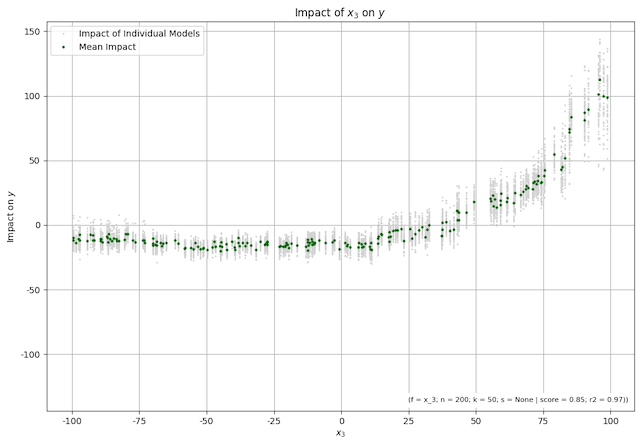
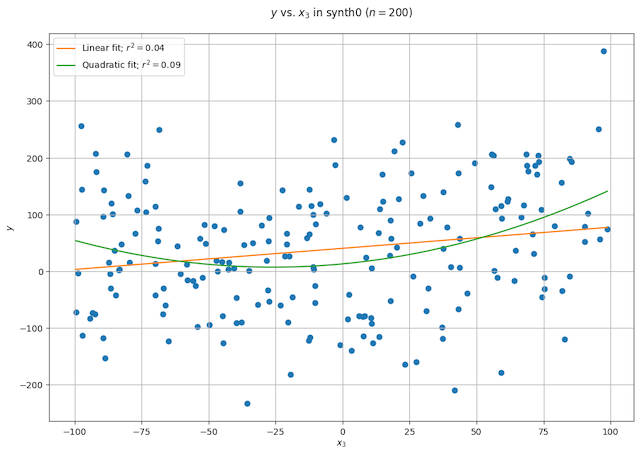
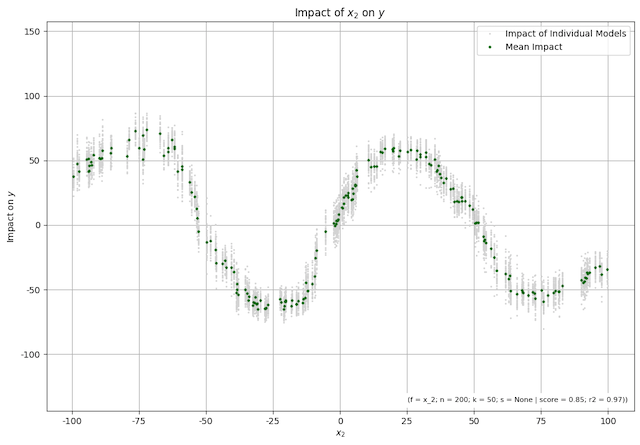
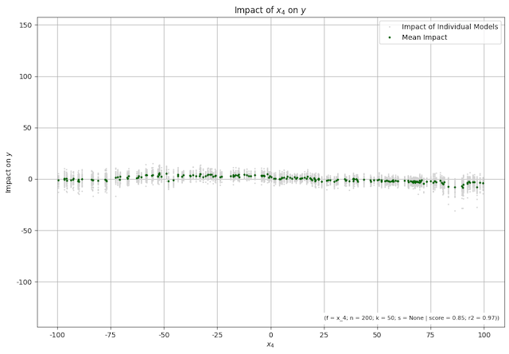
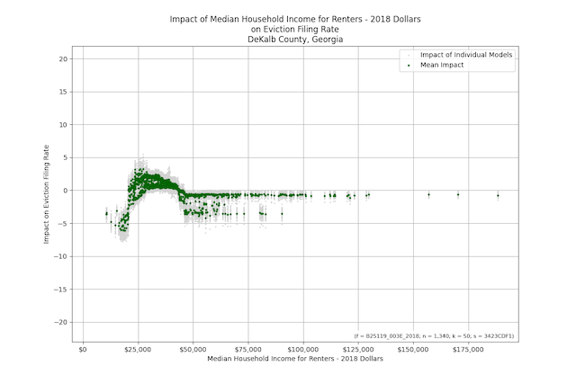
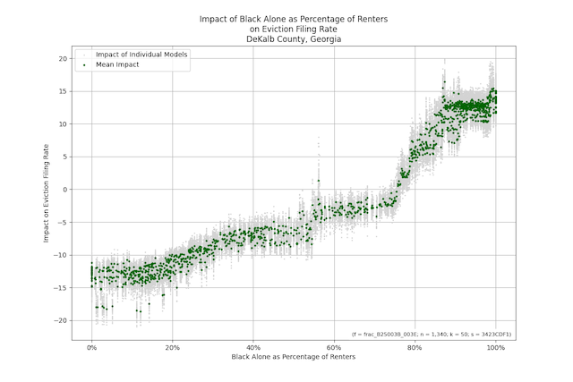

# impactchart

[](https://firstdonoharm.dev/version/3/0/cl-eco-extr-ffd-law-mil-sv.html)


[](https://vengroff.github.io/impactchart/)
[](https://vengroff.github.io/impactchart/)

`impactchart` is a Python library for generating impact charts.

## What are Impact Charts?

Impact charts make it easy to take a data set and visualize the impact of one variable 
on another in ways that techniques like scatter plots and linear regression can't, 
especially when there are other variables involved. 

For example, consider this impact chart, which looks at the impact of 
`x_3` on `y` in a particular data set:



The green dots represent our best estimate of the 
impact. The grey dots around them represent the estimate of the impact based on many
(in this case 50) different machine learning models. When they are close to the green
dots, as on the left side of the chart it means there is strong agreement among the
models as to the impact. When they are farther apart, as on the left side of the chart,
there is less agreement.

The general shape of the curve of green dots, and the fact that the gray dots remain
rather tightly grouped around it, suggest that the impact of `x_3` on `y` is very limited
when `x_3` is negative. But as it becomes increasingly positive, it's impact grows more 
and more rapidly. It might even be exponential \[Spoiler alert: this is synthetic data and 
the impact is exponential.].

Now let's compare what we see in the impact chart to a traditional scatter plot, which
is a popular way of taking a first look at the relationship between variables.
Using the same data set, here is a scatter plot of `y` vs. `x_3`:



In the scatter plot, we also added regression curves for linear regression and
quadratic regression, but they did not tell us much. The reason is that
in the data set we are looking at, `x_3` isn't the only feature that impacts
`y`. There are other `x_i` whose cumulative impact hides that of `x_3`.

The impact chart, on the other hand, we see the impact of `x_3` on `y` independent
of the effect of any other `x_i`. 

The reason impact charts like the one we are looking at are so powerful is that they 
very clealy and directly show us the impact of one feature in a data set on a target 
of interest.

Impact charts can find impact even though, unlike parametric regression techniques, 
they don't have any _a priori_ knowledge of the shape of the impacts they are looking for. 
For example, in the data set we have been looking at, there is another feature `x_2` whose 
impact on `y` is sinusoidal. And the impact chart for it shows this clearly



In general, no matter what the shape of the impact of one variable on another, 
whether it is polynomial, exponential, logarithmic, polylogarithmic, has seasonality 
or other repetitive structure, if the impact is there you are going
to get a good visualization with an impact chart.

And what if there is no impact? What if the two variables are not correlated at all.
We can see an example of that case in the following impact chart:



In this case, the impact chart is essentially flat at zero. There is a little bit
of random noise resulting from the way we created and trained the underlying machine
learning models, but the fact that there `x_4` had negligible impact on `y`, at least
relative to the impacts `x_2` and `x_3` had, is quite clear.

## What do Impact Charts on Real Data Look Like?

The data set we looked at above to introduce impact charts is synthetic. We deliberately
constructed it so some of the variables had known impacts and others had none. It was
part of a test to show that the ideas behind impact charts worked and that the code 
that we wrote to implement them was working.

But of course the real reason for impact charts is to look for impacts that we did not
deliberately put there for the code to find. So what do impact charts look like on real 
data? One of the first data sets we tried it on consists of data about the median income of renters,
the racial and ethnic make up of the population of renters, and the rate of eviction at the 
census tract level in hundreds of communities around the United States. We made impact charts
at the county level to show the impact of income, race, and ethnicity on eviction.

Here is an example:



This chart looks at the impact of the median household income of renters (at the census tract level)
on the eviction rate in DeKalb County, Georgia in years between 2009 and 2018. The impact is measured
in units of eviction cases filed per 100 renters. 

We might hypothesize that the lowest income renters
would have the highest eviction rates. But this impact chart tells us otherwise. In very low income
tracts, there is an impact around -5, meaning that these tracts have an eviction rate five points
lower than they otherwise would. Why would that be? In some cases, those at the very bottom of the income
scale live in public housing or voucher-supported housing (commonly known as Section-8). In these
kind of settings, they have more protection against eviction than renters do on the open market.

Between $25,000 and $40,000, the impact is almost entirely above zero. These tracts experience higher
rates of eviction because of their income level. This is consistent with a population of people
who have enough income to pay rent under normal circumstances but not enough to absorb the kind 
of shock (a major car repair or medical bill) that those with higher income might have the savings
or credit to survive without being evicted. Above $50,000 in household income, the curve is mostly 
flat at zero impact. This doesn't mean none of these people ever get evicted. It just means that
it is not their income that is driving the eviction. 

But between $50,00 and $100,000, the green
dots are bifircated into a zero impact group and a group around -3 to -4. Usually this means
there is some other variable that is causing the difference between the two, but it was not
present in our data set, so the models did the best they could in assigning that impact. If we could
add tha right variable to our data set, the effect would go away.

In just one chart, we can start to build a very interesting picture of the dynamics of the social and
economic processes behind the data. And we can compare the impact of variables. Without going into
all of the details we discuss 
[elsewhere](https://datapinions.com/the-impact-of-demographics-and-income-on-eviction-rates/)
here is another impact chart from the same data set. But instead of looking at the impact of 
median renter income, we look at the impact of the fraction of renters in a census tract who
identify as Black alone. The chart is:



Census tracts where very few Black renters live have a negative impact, meaning their eviction
rates are lower. The dats set include, income, whose impact we already looked at, so this
impact chart shows the impact that can be attributed to race independent of income, even if
the two are correlated to some degree. Note also that the two impact charts share the same
vertical scale, so that the magnitudes of the impacts can be compared.

If you would like to see more impact charts generated from this data set, please visit
[http://evl.datapinions.com/](http://evl.datapinions.com/).

## How Do I Make an Impact Chart

The first step is to install the `impactchart` code in a virtual environment using

```shell
pip install impactchart
```

From there, the simplest way to make your first impact chart is to 
replicate the code that generated the first impact charts we saw above, using
synthetic data. It is as follows:

```python
from impactchart.model import XGBoostImpactModel
from impactchartdemo.dataset import synth1

# Generate the data set:
N = 200
X, y = synth1.get_data(N)

# Construct and fit the impact chart model:
impact_model = XGBoostImpactModel()
impact_model.fit(X, y)

# Plot the charts. The return value is a dictionary
# with one chart per column of X.
impact_charts = impact_model.impact_charts(X)
```

There are other options to control and format the charts, but the 
code above is sufficient to get the job done.

For more details, please see the 
`Synthetic Data.ipynb` 
notebook, from which the code above is derived.

## How Do Impact Charts Work

Impact charts are built on top of 
[shap](https://github.com/shap/shap), 
which uses Shapley values to interpret predictions made by
machine learning models. For more details on how this is done,
please see 
[this paper](https://datapinions.com/wp-content/uploads/2024/01/impactcharts.pdf) 
and/or 
[this blog post](https://datapinions.com/an-introduction-to-impact-charts/).

## More on Impact Charts

Applications built on top of `impactchart` be found in the 
projects [evlcharts](https://github.com/vengroff/evlcharts) and
[rihcharts](https://github.com/vengroff/rihcharts).

An earlier version of the code that led to what is now
here produced the impact charts available at [http://rih.datapinions.com/impact.html](http://rih.datapinions.com/impact.html).
This work, and the motivation for the impact chart approach, is discussed at length in the blog post
[Using Interpretable Machine Learning to Analyze Racial and Ethnic Disparities in Home Values](https://datapinions.com/using-interpretable-machine-learning-to-analyze-racial-and-ethnic-disparities-in-home-values/).
